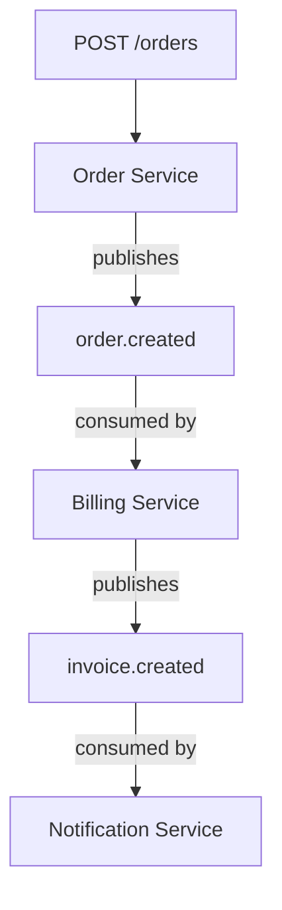
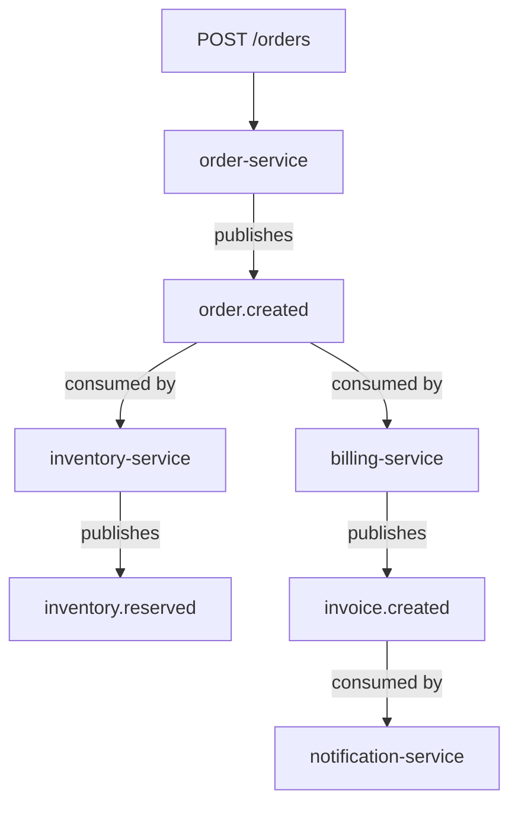

# Distributed System Flow Tracer

## Purpose

Trace an application entry point through a distributed system and reconstruct the complete downstream interaction graph.

Given an API endpoint, function, command, event, or other entry point, investigate the code and infrastructure to discover:

* Which application handles the entry point
* Which internal or external services it calls
* Which messages or events it publishes
* Which messaging infrastructure carries those messages
* Which applications consume those messages
* What each consumer does next
* Which additional services, APIs, events, or messages are triggered
* The complete downstream flow

The final result should be a **Mermaid graph** representing the discovered flow.

The skill must be **technology-agnostic**.

Do not assume a specific:

* Programming language
* Framework
* Cloud provider
* Messaging technology
* Deployment platform
* Architecture style

Examples of technologies that may be encountered include Java, TypeScript, Python, Go, C#, Kafka, Google Pub/Sub, RabbitMQ, AWS SQS/SNS, Azure Service Bus, NATS, HTTP, gRPC, webhooks, and others.

---

## Core Principle

Start from an entry point and recursively follow the system.

Do not attempt to document the entire architecture upfront.

The investigation should be **entry-point driven**.

For example:

```text
POST /orders
    ↓
Order Service
    ↓
order.created
    ↓
Billing Service
    ↓
invoice.created
    ↓
Notification Service
```

The goal is to discover this flow automatically.

---

## Input

The user should provide an entry point such as:

```text
POST /orders
```

or:

```text
GET /customers/{id}
```

or:

```text
OrderService.createOrder()
```

or:

```text
order.created
```

If the user provides an API endpoint, use it as the root of the investigation.

---

## Investigation Algorithm

### Step 1 — Identify the Entry Point

Locate the implementation of the requested entry point.

Determine:

* Application/service
* Controller/handler/function
* Repository or source location
* Relevant implementation

Do not rely only on filenames or documentation.

Prefer evidence from source code and configuration.

Record the discovered node.

Example:

```text
POST /orders
    ↓
order-service
    ↓
OrderController.createOrder()
```

---

### Step 2 — Inspect the Execution Flow

Follow the implementation far enough to identify meaningful downstream interactions.

Look for:

* HTTP calls
* REST clients
* GraphQL calls
* gRPC calls
* SDK/API calls
* database interactions
* message publishing
* event publishing
* job scheduling
* webhooks
* function invocations
* queue operations
* other service-to-service communication

Do not assume that every function call represents a distributed-system edge.

Focus on interactions that cross application, process, infrastructure, or system boundaries.

---

### Step 3 — Normalize Interactions

Regardless of the underlying technology, normalize discovered interactions into generic concepts.

Use concepts such as:

```text
SERVICE
ENDPOINT
OPERATION
MESSAGE
EVENT
QUEUE
TOPIC
DATABASE
EXTERNAL_SYSTEM
```

And relationships such as:

```text
CALLS
PUBLISHES
CONSUMES
TRIGGERS
READS
WRITES
SCHEDULES
INVOKES
```

The internal representation should not depend on Kafka, Pub/Sub, RabbitMQ, Java, Spring, etc.

For example:

```text
Kafka topic
Google Pub/Sub topic
RabbitMQ exchange
AWS SQS queue
Azure Service Bus topic
```

may all represent a messaging relationship:

```text
MESSAGE
```

Preserve the actual technology as metadata when it is known.

Example:

```text
MESSAGE: order.created
transport: Google Pub/Sub
```

---

### Step 4 — Follow Synchronous Dependencies

When the current component calls another service synchronously:

```text
Order Service
    ↓ HTTP
Inventory Service
```

identify the target service and continue investigating that service.

Determine:

* Which endpoint/function receives the call
* What it does
* What downstream interactions it performs

Continue recursively.

---

### Step 5 — Follow Asynchronous Dependencies

When the current component publishes a message or event:

```text
Order Service
    ↓
order.created
```

identify the messaging destination.

Determine, using the available environment and tools:

* Topic/queue/exchange/stream
* Consumers/subscriptions
* Consumer applications
* Relevant handlers

For each discovered consumer:

```text
order.created
    ↓
Billing Service
```

open or locate the consumer's implementation and inspect what it does.

Then continue recursively.

---

### Step 6 — Continue Recursively

Every discovered service becomes a new investigation point.

For example:

```text
API
 ↓
Service A
 ↓
Message A
 ↓
Service B
 ↓
Message B
 ↓
Service C
 ↓
HTTP
 ↓
Service D
```

Continue until no new meaningful downstream interactions are discovered.

The traversal must work across mixed technologies.

Example:

```text
Java
 ↓
Kafka
 ↓
Node.js
 ↓
HTTP
 ↓
Python
 ↓
Google Pub/Sub
 ↓
Go
```

Do not stop because the technology changes.

---

### Step 7 — Avoid Cycles

Distributed systems may contain cycles.

Maintain a set of already investigated nodes and relationships.

For example:

```text
Service A
   ↓
Event X
   ↓
Service B
   ↓
Event Y
   ↓
Service A
```

Do not recursively investigate the same node forever.

When a previously discovered node is encountered:

```text
Already discovered: Service A
```

record the relationship but do not traverse it again.

---

## Evidence and Confidence

Prefer direct evidence over assumptions.

Evidence may come from:

* Source code
* Configuration
* Infrastructure definitions
* Repository metadata
* Messaging infrastructure
* Service configuration
* Deployment configuration
* Logs
* Runtime information
* Traces
* Documentation

When possible, preserve the evidence supporting each relationship.

Example:

```text
order-service
    --publishes-->
order.created

Evidence:
OrderService.java:142
```

If a relationship is inferred rather than directly verified, mark it as inferred.

Do not fabricate architecture.

If the relationship cannot be verified, state that clearly.

---

## Technology-Agnostic Investigation

Never hard-code assumptions such as:

```text
"Search for @KafkaListener"
```

as the only discovery mechanism.

Instead reason about the behavior:

> Find where this application receives messages.

Likewise, do not assume:

```text
"publisher.publish()"
```

is the only way a message is produced.

Look for the actual implementation patterns used by the project.

The agent may use:

* Repository search
* Source inspection
* Cloud CLI
* Messaging CLI
* APIs
* Infrastructure configuration
* Runtime information
* Existing documentation

Choose the appropriate tool based on the environment.

---

## Mermaid Output

The primary output must be a Mermaid graph.

Prefer a clear top-down graph:



Keep the graph readable.

Do not create a separate node for every function call.

Only include implementation details when they help explain a distributed interaction.

---

## Output Requirements

The final response should contain:

### 1. Mermaid Graph

The complete discovered flow.

### 2. Short Summary

Briefly describe:

* Entry point
* Services discovered
* Messages/events discovered
* Important downstream effects

### 3. Unverified Relationships

List relationships that could not be confirmed.

Example:

```text
Unverified:
- fraud-service appears to consume order.created,
  but the consumer could not be located.
```

Do not hide uncertainty.

---

## Investigation Rules

1. Start from the requested entry point.
2. Follow the actual implementation.
3. Identify distributed interactions.
4. Resolve their targets.
5. Inspect every newly discovered consumer/service.
6. Continue recursively.
7. Support synchronous and asynchronous flows.
8. Remain independent of programming language and messaging technology.
9. Prefer evidence over inference.
10. Avoid cycles.
11. Do not invent missing relationships.
12. Generate Mermaid as the primary result.
13. Keep the investigation focused on the requested flow.
14. Do not attempt to build a complete architecture inventory unless required to resolve the requested flow.

---

## Example

User:

```text
Trace POST /orders
```

The agent discovers:

```text
POST /orders
    ↓
order-service
    ↓
publishes order.created
    ↓
messaging infrastructure
    ├── inventory-service
    │       ↓
    │   publishes inventory.reserved
    │
    └── billing-service
            ↓
        publishes invoice.created
                ↓
        notification-service
```

The final output should be:



The technology used to implement this flow is secondary.

The objective is to answer one question:

> **"Starting from this entry point, what happens next throughout the distributed system?"**
